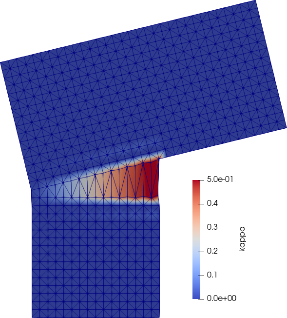
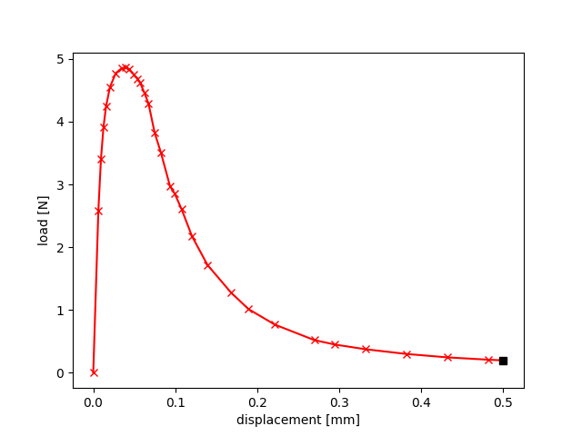

# fenics_helpers

Little Helper classes that come up repeatedly when writing solvers in FEniCS

# Example: Local damage model

The [local damage](examples(local_damage.py) example illustrates the use of `.boundary` to conveniently select the boundaries like

~~~py
bot = fh.boundary.plane_at(-10, "y") 
right = fh.boundary.plane_at(10, "x") 
~~~

and `.timestepping` is used to reduce the time step size only at critical points in the simulation to accelerate the time integration.

